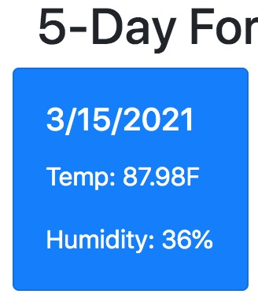

# Weather Dashboard

## Description 

In order to demonstrate that I have learned and practiced calling API's, I created this web app. Using jQuery and vanilla javascript,
I make two API calls to Open Weather's API. The first gets a city name that you input when you press the search button. This gets the 
Latitude and Longitude of the city you have searched. At this point, I make another API call, also to Open Weather, to get a bit more info,
especially the 5-day forecast.

This works best if you enter a city name correctly. If you input something that is not a city that the API fetch recognizes, you will be
alerted to please pick a city name.

I structured the directories and named my repo to comply with best practices.

After you make a successful search, your city name is added to the Local Storage and is dynamically created to a previous search list.

You can find my Weather Dashboard at https://clayto30.github.io/weather-dashboard/

## Installation

My password Generator is deployed from my GitHub Repo https://github.com/Clayto30/Password-Generator

Feel free to head to my website and punch in a city name and press the blue search button! 

## Usage 

With everything that is going on right now, 
this feels like traveling and getting a different experience! Go ahead, where have you been missing? Where would you have gone if you could have
this year? Put it in, and imagine you feel the sun or frost! 

## Credits

John Baxter is my TA at the UCBExt Coding Bootcamp, and he and the rest of the instructional staff provided exceptional instruction. I couldn't
have done this without them

The UCBExtension Coding Bootcamp designed this as a challenge, including an app mockup, and functionality design. This instruction is 
of course, essential to what I've done here. 

## License

Copyright (c) 2021 Clayton Goff

Permission is hereby granted, free of charge, to any person obtaining a copy
of this software and associated documentation files (the "Software"), to deal
in the Software without restriction, including without limitation the rights
to use, copy, modify, merge, publish, distribute, sublicense, and/or sell
copies of the Software, and to permit persons to whom the Software is
furnished to do so, subject to the following conditions:

The above copyright notice and this permission notice shall be included in all
copies or substantial portions of the Software.

THE SOFTWARE IS PROVIDED "AS IS", WITHOUT WARRANTY OF ANY KIND, EXPRESS OR
IMPLIED, INCLUDING BUT NOT LIMITED TO THE WARRANTIES OF MERCHANTABILITY,
FITNESS FOR A PARTICULAR PURPOSE AND NONINFRINGEMENT. IN NO EVENT SHALL THE
AUTHORS OR COPYRIGHT HOLDERS BE LIABLE FOR ANY CLAIM, DAMAGES OR OTHER
LIABILITY, WHETHER IN AN ACTION OF CONTRACT, TORT OR OTHERWISE, ARISING FROM,
OUT OF OR IN CONNECTION WITH THE SOFTWARE OR THE USE OR OTHER DEALINGS IN THE
SOFTWARE.
